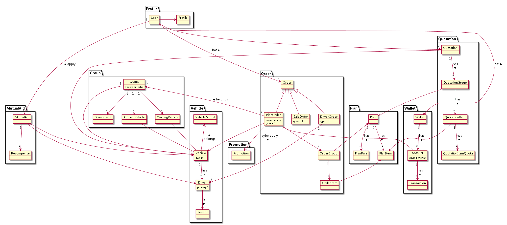

MockServer
==========

MockServer 是蜂巢互助服务仿真程序，通过 vue-hive-rpc 插件在页面中调用，可得到预
先保存在 data 目录下的仿真数据。

设置
----

    npm install

运行
----

    node mockserver.js

数据
----

数据以 json 作为数据格式，按模块划分目录，用方法名作为文件名前缀，保存在 data 目
录下。

比如下面的 rpc 调用:

    rpc.call("module0", "function0", "argument0", "argument1");

将会获取 `data/module0/function0.json` 中的数据。如果该文件不存在，则 MockServer
返回 404 错误信息。

文档
----

[计划模块](doc/plan.md)

[订单模块](doc/order.md)

[蜂巢模块](doc/hive.md)

[钱包模块](doc/wallet.md)

[互助模块](doc/mutual-aid.md)

[车模块](doc/vehicle.md)

[用户模块](doc/profile.md)

