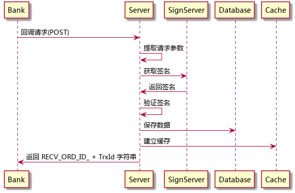
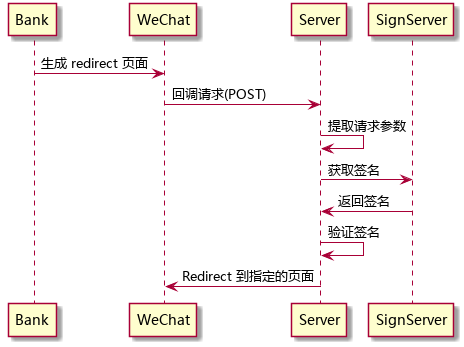
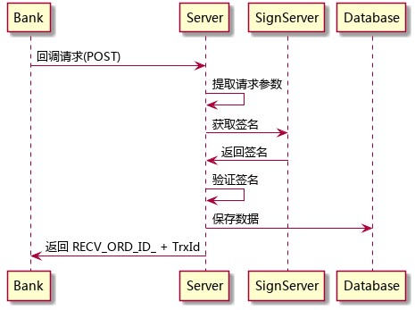

# bank-callback 模块

bank-callback 是一个特殊的模块，不遵循 hive-server 和 hive-processor 的约定。bank-callback 模块启动一个 web server，供银行业务系统进行回调。

## 修改记录

1. 2016-09-25
  * 增加缓存设计。
  * 增加调用序列图。

## 缓存结构

| key            | type | value            | note                        |
| ----           | ---- | ----             | ----                        |
| bank-customers | hash | openid => custid | openid 与 custid 的对应关系 |

注意：openid 只有 25 个字节长。

## 数据库结构

### bank\_customers

| field       | type      | null | default | index   | reference |
| ----        | ----      | ---- | ----    | ----    | ----      |
| id          | uuid      |      |         | primary |           |
| openid      | char(25)  |      |         |         |           |
| cust\_id    | char(16)  |      |         |         |           |
| created\_at | timestamp |      | now     |         |           |
| updated\_at | timestamp |      | now     |         |           |
| deleted     | boolean   |      | false   |         |           |

### bank\_netsave

| field       | type      | null | default | index   | reference |
| ----        | ----      | ---- | ----    | ----    | ----      |
| id          | uuid      |      |         | primary |           |
| cust\_id    | char(16)  |      |         |         |           |
| ord\_id     | char(30)  |      |         |         |           |
| data        | json      |      |         |         |           |
| done        | boolean   |      | false   |         |           |
| created\_at | timestamp |      | now     |         |           |
| updated\_at | timestamp |      | now     |         |           |
| deleted     | boolean   |      | false   |         |           |

充值回调的其它参数用 json 格式存放在 data 字段中。done 字段表明该数据是否被后台服务所处理。

## 接口

### 开户回调 register

register 响应银行的开户回调，调用参数与返回结果见《汇付天下P2P系统托管平台接口规范-v2.7.0\_20160603.pdf》

register 的数据保存到 bank\_customers 表中，同时更新 bank-customers 缓存。

### 开户页面回调 RegisterCallback

RegisterCallback 响应银行的开户页面响应，提取响应编码和响应内容，用 redirect 方式将客户端转移到前端页面。

| 场景 | 内容                                                    |
| ---- | ----                                                    |
| 正式 | http://m.fengchaohuzhu.com/#/BankUserRegisterCallback   |
| 测试 | http://dev.fengchaohuzhu.com/#/BankUserRegisterCallback |

### 充值回调 netsave

netsave 响应银行的充值回调，调用参数与返回结果见《汇付天下P2P系统托管平台接口规范-v2.7.0\_20160603.pdf》

netsave 的数据保存到 bank\_netsave 表中, 核心数据保存 cust\_id 和 ord\_id，其余数据以 json 格式保存在 data 字段中。

### 充值页面回调 NetSaveCallback

NetSaveCallback 响应银行的开户页面响应，提取响应编码和响应内容，用 redirect 方式将客户端转移到前端页面。

| 场景 | 内容                                           |
| ---- | ----                                           |
| 正式 | http://m.fengchaohuzhu.com/#/NetSaveCallback   |
| 测试 | http://dev.fengchaohuzhu.com/#/NetSaveCallback |

*调用序列图见开户页面回调*
