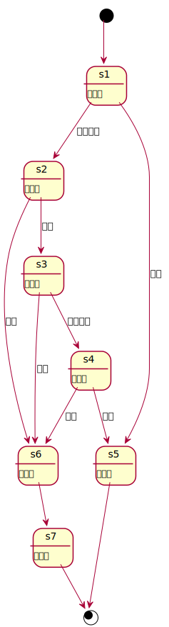
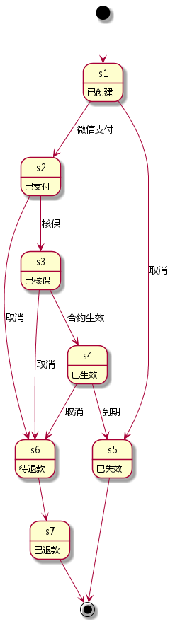

# Order 模块

## 数据结构

### driver-order

| name       | type     | note         |
| ----       | ----     | ----         |
| id         | uuid     | 主键         |
| type       | int      | 订单类型 1   |
| state-code | int      | 订单状态编码 |
| state      | string   | 订单状态     |
| vehicle    | vehicle  | 车辆         |
| drivers    | [driver] | 增加的司机   |
| summary    | float    | 订单总额     |
| payment    | float    | 订单实付     |
| start-at   | date     | 合约生效时间 |
| stop-at    | date     | 合约失效时间 |

### sale-order

| name       | type         | note              |
| ----       | ----         | ----              |
| id         | uuid         | 主键              |
| type       | int          | 订单类型 2        |
| state-code | int          | 订单状态编码      |
| state      | string       | 订单状态          |
| vehicle    | vehicle      | 车辆              |
| plan       | plan         | 对应的 plan       |
| items      | [order-item] | 包含的 order-item |
| summary    | float        | 订单总额          |
| payment    | float        | 订单实付          |
| start-at   | date         | 合约生效时间      |
| stop-at    | date         | 合约失效时间      |

### plan-order

| name          | type         | note              |
| ----          | ----         | ----              |
| id            | uuid         | 主键              |
| type          | int          | 订单类型 0        |
| state-code    | int          | 订单状态编码      |
| state         | string       | 订单状态          |
| vehicle       | vehicle      | 车辆              |
| plans         | [plan]       | 包含的 plan       |
| items         | [order-item] | 包含的 order-item |
| promotion     | promotion    | 促销              |
| service-ratio | float        | 服务费率          |
| summary       | float        | 订单总额          |
| payment       | float        | 订单实付          |
| expect-at     | date         | 预计生效日期      |
| start-at      | date         | 合约生效时间      |
| stop-at       | date         | 合约失效时间      |

### order-item

| name      | type      | note             |
| ----      | ----      | ----             |
| id        | uuid      | 主键             |
| plan-item | plan-item | 对应的 plan-item |
| price     | float     | 价格             |

### order-event

| name        | type | note                |
| ----        | ---- | ----                |
| id          | uuid | 主键                |
| oid         | uuid | 订单 ID             |
| uid         | uuid | 触发事件的人        |
| data        | json | JSON 格式的事件数据 |
| occurred-at | date | 事件发生时间        |

### order states

[](订单状态转换图)
[](订单状态转换图)

### underwrite

| name                   | type      | note                     |
| ---------------------  | --------  | --------------           |
| order                  | order     | 订单                     |
| quotation              | quotation | 报价                     |
| operator               | operator  | 验车工作人员             |
| plan\_time             | ISO8601   | 计划核保时间             |
| real\_time             | ISO8601   | 实际核保完成时间         |
| validate\_place        | string    | 预约验车地点             |
| validate\_update\_time | ISO8601   | 预约验车地点最后修改时间 |
| real\_place            | string    | 实际验车地点             |
| real\_update\_time     | ISO8601   | 实际验车地点最后修改时间 |
| certificate\_state     | int       | 用户证件上传情况         |
| problems               | [problem] | 车辆存在问题             |
| note                   | string    | 备注                     |
| note\_update\_time     | ISO8601   | 备注最后修改时间         |
| photos                 | [photo]   | 照片                     |
| underwrite\_result     | string    | 核保结果                 |
| result\_update\_time   | ISO8601   | 核保结果最后修改时间     |

### photo

| name         | type      | note         |
| ----         | ----      | ----         |
| photo        | string    | 照片         |

### problem

| name        | type   | note             |
| ----        | ----   | ----             |
| type        | string | 车辆存在问题类型 |
| description | string | 车辆存在问题描述 |

## 数据库结构

### orders

| field       | type      | null | default | index   | reference |
| ----        | ----      | ---- | ----    | ----    | ----      |
| id          | uuid      |      |         | primary |           |
| vid         | uuid      |      |         |         | vehicles  |
| type        | smallint  |      | 0       |         |           |
| state\_code | int       |      | 0       |         |           |
| state       | string    | ✓    |         |         |           |
| summary     | float     |      | 0.0     |         |           |
| payment     | float     |      | 0.0     |         |           |
| start\_at   | timestamp |      | now     |         |           |
| stop\_at    | timestamp |      | now     |         |           |
| created\_at | timestamp |      | now     |         |           |
| updated\_at | timestamp |      | now     |         |           |

### plan\_order\_ext

| field          | type      | null | default | index   | reference  |
| ----           | ----      | ---- | ----    | ----    | ----       |
| id             | serial    |      |         | primary |            |
| oid            | uuid      |      |         |         | orders     |
| pid            | uuid      |      |         |         | plans      |
| qid            | uuid      |      |         |         | quotations |
| pmid           | uuid      | ✓    |         |         | promotions |
| service\_ratio | float     |      |         |         |            |
| expect\_at     | timestamp |      | now     |         |            |
| created\_at    | timestamp |      | now     |         |            |
| updated\_at    | timestamp |      | now     |         |            |

### driver\_order\_ext

| field       | type      | null | default | index   | reference |
| ----        | ----      | ---- | ----    | ----    | ----      |
| id          | serial    |      |         | primary |           |
| oid         | uuid      |      |         |         | orders    |
| pid         | uuid      |      |         |         | person    |
| created\_at | timestamp |      | now     |         |           |
| updated\_at | timestamp |      | now     |         |           |

### sale\_order\_ext

| field       | type      | null | default | index   | reference  |
| ----        | ----      | ---- | ----    | ----    | ----       |
| id          | serial    |      |         | primary |            |
| oid         | uuid      |      |         |         | orders     |
| pid         | uuid      |      |         |         | plans      |
| qid         | uuid      |      |         |         | quotations |
| created\_at | timestamp |      | now     |         |            |
| updated\_at | timestamp |      | now     |         |            |

### order\_items

| field | type  | null | default | index   | reference   |
| ----  | ----  | ---- | ----    | ----    | ----        |
| id    | uuid  |      |         | primary |             |
| piid  | uuid  |      |         |         | plan\_items |
| pid   | uuid  |      |         | ✓       |             |
| price | float |      | 0.0     |         |             |

注意：此表的 pid 不是 plan-id 的缩写，是 parent-id 的意思。
可以成为 parent 的有 plan (对应 plan-order)，或者 sale-order。

### order\_events

| field        | type      | null | default | index   | reference |
| ----         | ----      | ---- | ----    | ----    | ----      |
| id           | uuid      |      |         | primary |           |
| oid          | uuid      |      |         |         |           |
| uid          | uuid      |      |         |         |           |
| data         | json      |      |         |         |           |
| occurred\_at | timestamp |      | now     |         |           |

### underwrite

| field                  | type      | null | default | index   | reference |
| ----                   | ----      | ---- | ----    | ----    | ----      |
| id                     | uuid      |      |         | primary |           |
| oid                    | uuid      |      |         |         | orders    |
| opid                   | uuid      | ✓    |         |         | operators |
| plan\_time             | timestamp |      |         |         |           |
| real\_time             | timestamp | ✓    |         |         |           |
| validate\_place        | char(256) |      |         |         |           |
| validate\_update\_time | timestamp |      |         |         |           |
| real\_place            | char(256) | ✓    |         |         |           |
| real\_update\_time     | timestamp | ✓    |         |         |           |
| certificate\_state     | int       | ✓    |         |         |           |
| note                   | text      | ✓    |         |         |           |
| note\_update\_time     | timestamp | ✓    |         |         |           |
| underwrite\_result     | char(10)  | ✓    |         |         |           |
| result\_update\_time   | timestamp | ✓    |         |         |           |
| created\_at            | timestamp |      | now     |         |           |
| updated\_at            | timestamp |      | now     |         |           |
| deleted                | boolean   |      | false   |         |           |

| certificate\_state | meaning      |
| ----               | ----         |
| 0                  | 未上传证件   |
| 1                  | 上传部分证件 |
| 2                  | 证件全部上传 |

### photos

| field                  | type       | null | default | index   | reference  |
| ----                   | ----       | ---- | ----    | ----    | ----       |
| id                     | uuid       |      |         | primary |            |
| uwid                   | uuid       |      |         |         | underwrite |
| photo                  | char(1024) |      |         |         |            |
| created\_at            | timestamp  |      | now     |         |            |
| updated\_at            | timestamp  |      | now     |         |            |
| deleted                | boolean    |      | false   |         |            |

### problems

| field       | type      | null | default | index   | reference  |
| ----        | ----      | ---- | ----    | ----    | ----       |
| id          | uuid      |      |         | primary |            |
| uwid        | uuid      |      |         |         | underwrite |
| type        | char(32)  |      |         |         |            |
| description | text      |      |         |         |            |
| created\_at | timestamp |      | now     |         |            |
| updated\_at | timestamp |      | now     |         |            |
| deleted     | boolean   |      | false   |         |            |

## 缓存结构

### driver-order

| key           | type       | value                  | note         |
| ----          | ----       | ----                   | ----         |
| driver-orders | sorted set | (订单更新时间, 订单ID) | 司机订单汇总 |

### sale-order

| key         | type       | value                  | note         |
| ----        | ----       | ----                   | ----         |
| sale-orders | sorted set | (订单更新时间, 订单ID) | 代售订单汇总 |

### plan-order

| key         | type       | value                  | note         |
| ----        | ----       | ----                   | ----         |
| plan-orders | sorted set | (订单更新时间, 订单ID) | 计划订单汇总 |

### orders

| key          | type       | value                  | note           |
| ----         | ----       | ----                   | ----           |
| orders       | sorted set | (订单更新时间, 订单ID) | 订单汇总       |
| orders-{uid} | sorted set | (订单更新时间, 订单ID) | 每个用户的订单 |

### order-entities

| key            | type | value               | note         |
| ----           | ---- | ----                | ----         |
| order-entities | hash | 订单ID => 订单 JSON | 所有订单实体 |

### order-driver-entities

| key                    | type | value               | note             |
| ----                   | ---- | ----                | ----             |
| order-driver-entities  | hash | VID =>  驾驶人 JSON  | 所有车辆已生效驾驶人| 

### underwrite

| key           | type       | value                  | note     |
| ----          | ----       | ----                   | ----     |
| underwrite-id | sorted set | (核保更新时间, 核保ID) | 核保汇总 |

### underwrite-entities

| key            | type | value               | note         |
| ----           | ---- | ----                | ----         |
| underwrite-entities | hash | 核保ID => 核保 JSON | 所有核保实体 |

## 接口

### 下计划单 placeAnPlanOrder

#### request

| name          | type         | note         |
| ----          | ----         | ----         |
| vid           | uuid         | 车辆 ID      |
| plans         | {pid: items} | 计划 ID 列表 |
| qid           | uuid         | 报价 ID      |
| pm_price      | float        | 优惠价格      |
| service-ratio | float        | 服务费率     |
| summary       | float        | 总价         |
| payment       | float        | 实付         |
| v_value       | float        | 车辆实际价值  |
其中, items 的结构为: `{piid: price}`。piid 是 plan-item 的 ID。

```javascript
let vid = "00000000-0000-0000-0000-000000000000";
let qid = "00000000-0000-0000-0000-000000000000";
let plans = {
  "00000000-0000-0000-0000-000000000000": {
    "00000000-0000-0000-0000-000000000000": 1000.00,
    "00000000-0000-0000-0000-000000000001": 2000.00
  },
  "00000000-0000-0000-0000-000000000001": {
    "00000000-0000-0000-0000-000000000002": 1000.00,
    "00000000-0000-0000-0000-000000000003": 2000.00
  }
};
let pm_price = 500;
let service_ratio = 0;
let summary = 6000;
let payment = 6000;
let v_value = 100000;
let expect_at = "2016-08-01T00:00:00.000+800Z";

rpc.call("order", "placeAnPlanOrder", vid, plans, qid, pmid, service_ratio, summary, payment, expect_at)
  .then(function (result) {

  }, function (error) {

  });

```

#### response

| name     | type   | note     |
| ----     | ----   | ----     |
| order-id | uuid   | Order ID |
| order-no | string | Order No |

See [example](../data/order/placeAnPlanOrder.json)

### 下司机单 placeAnDriverOrder

#### request

| name    | type   | note         |
| ----    | ----   | ----         |
| vid     | uuid   | 车辆 ID      |
| dids    | [uuid] | 司机 ID 列表 |
| summary | float  | 总价         |
| payment | float  | 实付         |

```javascript
let vid = "00000000-0000-0000-0000-000000000000";
let dids = [
  "00000000-0000-0000-0000-000000000000",
  "00000000-0000-0000-0000-000000000001",
  "00000000-0000-0000-0000-000000000002",
  "00000000-0000-0000-0000-000000000003"
];
let summary = 200;
let payment = 200;

rpc.call("order", "placeAnDriverOrder", vid, dids, summary, payment)
  .then(function (result) {

  }, function (error) {

  });

```

#### response

| name     | type   | note     |
| ----     | ----   | ----     |
| order-id | uuid   | Order ID |
| order-no | string | Order No |

See [example](../data/order/placeAnDriverOrder.json)

### 下代售单 placeAnSaleOrder

#### request

| name    | type          | note     |
| ----    | ----          | ----     |
| vid     | uuid          | 车辆 ID  |
| qid     | uuid          | 报价 ID  |
| items   | {piid: price} | 代售条目 |
| summary | float         | 总价     |
| payment | float         | 实付     |

```javascript
let vid = "00000000-0000-0000-0000-000000000000";
let qid = "00000000-0000-0000-0000-000000000000";
let items = {
  "00000000-0000-0000-0000-000000000000": 1000,
  "00000000-0000-0000-0000-000000000001": 2000
};
let summary = 2000;
let payment = 2000;

rpc.call("order", "placeAnSaleOrder", vid, qid, items, summary, payment)
  .then(function (result) {

  }, function (error) {

  });

```

### 更新订单状态 updateOrderState

#### request

| name       | type          | note      |
| ----       | ----          | ----      |
| order_id   | uuid          | 订单 ID   |
| state_code | int           |订单状态编码 |
| state      | string        |订单状态    |

```javascript
let order_id = "00000000-0000-0000-0000-000000000000";
let state_code = 2;
let state = '已支付';

rpc.call("order", "updateOrderState", order_id, state_code, state)
  .then(function (result) {

  }, function (error) {

  });

```

#### response

| name     | type   | note     |
| ----     | ----   | ----     |
| order-id | uuid   | Order ID |


### 获取订单列表 getOrders

#### request

| name   | type | note           |
| ----   | ---- | ----           |
| uid    | uuid | User ID        |
| offset | int  | 结果集起始地址   | 
| limit  | int  | 结果集大小      |

#### response

| name   | type    | note   |
| ----   | ----    | ----   |
| orders | [order] | Orders |

See [example](../data/order/getOrders.json)

### 获取订单详情 getOrder

#### request

| name     | type | note      |
| ----     | ---- | ----      |
| order-id | uuid | Order ID |

#### response

| name  | type  | note       |
| ----  | ----  | ----       |
| order | order | Order 详情 |

### 获取驾驶人信息 getDriverOrders 

#### request

| name     | type | note      |
| ----     | ---- | ----      |
| vid      | uuid | vehicle ID  |

#### response

| name    | type   | note         |
| ----    | ----   | ----         |
| drivers | driver | 驾驶人详情详情 | 


See [计划订单](../data/order/getPlanOrder.json)

See [司机订单](../data/order/getDriverOrder.json)

See [代售订单](../data/order/getSaleOrder.json)

### 生成核保 createUnderwrite

#### request

| name                 | type      | note                     |
| ----                 | ----      | ----                     |
| oid                  | uuid      | 订单id                   |
| plan_time            | timestamp | 计划核保时间             |
| validate_place       | string    | 预约验车地点             |
| validate_update_time | timestamp | 预约验车地点最后修改时间 |

##### example

```javascript

rpc.call("underwrite", "createUnderwrite", oid, plan_time, validate_place, validate_update_time)
  .then(function (result) {

  }, function (error) {
        
  });
```

#### response

| name   | type   | note     |
| ----   | ----   | ----     |
| code   | int    | 结果编码  |
| msg    | string | 结果内容  |

| code  | msg      | meaning |
| ----  | ----     | ----    |
| 200   | null     | 成功    |
| other | 错误信息 | 失败    |

See 成功返回数据：[example](../data/underwrite/createUnderwrite.json)


### 工作人员填充验车信息 fillUnderwrite

#### request

| name              | type      | note             |
| ----              | ----      | ----             |
| real_place        | string    | 实际验车地点     |
| operator          | operator  | 验车工作人员     |
| certificate_state | int       | 用户证件上传情况 |
| problems          | [problem] | 车辆存在问题     |
| photos            | [photo]   | 照片             |


##### example

```javascript

var real_place = "北京市东城区东直门东方银座";
var operator = "张三";
var certificate_state = 1;
var problems = [
  {
    "type" : "剐蹭",
    "description" :"追尾。。。。"
  },
  {
    "type" : "剐蹭",
    "description" :"追尾。。。。"
  }
]


rpc.call("underwrite", "fillUnderwrite", real_place, operator, certificate_state, problems, photos)
  .then(function (result) {

  }, function (error) {
        
  });
```

#### response

| name | type   | note     |
| ---- | ----   | ----     |
| code | int    | 结果编码 |
| msg  | string | 结果内容 |

| code  | msg      | meaning |
| ----  | ----     | ----    |
| 200   | null     | 成功    |
| other | 错误信息 | 失败    |

See 成功返回数据：[example](../data/underwrite/fillUnderwrite.json)

### 提交审核结果 submitUnderwriteResult

#### request

| name               | type    | note                 |
| ----               | ----    | ----                 |
| underwrite_result  | string  | 核保结果             |
| result_update_time | ISO8601 | 核保结果最后修改时间 |

##### example

```javascript

var underwrite_result = "未通过";
var result_update_time = "9999-12-31 23:59:59"

rpc.call("underwrite", "submitUnderwriteResult", underwrite_result, result_update_time)
  .then(function (result) {

  }, function (error) {
        
  });
```

#### response

| name  | type     | note     |
| ----  | ----     | ----     |
| code  | int      | 结果编码 |
| msg   | string   | 结果内容 |

| code  | msg      | meaning  |
| ----  | ----     | ----     |
| 200   | null     | 成功     |
| other | 错误信息 | 失败     |

See 成功返回数据：[example](../data/underwrite/sucessful.json)

### 修改预约验车地点  alterValidatePlace

#### request

| name                 | type    | note                     |
| ----                 | ----    | ----                     |
| validate_place       | string  | 预约验车地点             |
| validate_update_time | ISO8601 | 预约验车地点最后修改时间 |

##### example

```javascript

var validate_place = "北京市东城区东直门东方银座";
var validate_update_time = "9999-12-31 23:59:59"

rpc.call("underwrite", "alterValidatePlace", validate_place, validate_update_time)
  .then(function (result) {

  }, function (error) {
        
  });
```

#### response

| name | type   | note     |
| ---- | ----   | ----     |
| code | int    | 结果编码 |
| msg  | string | 结果内容 |

| code  | msg      | meaning |
| ----  | ----     | ----    |
| 200   | null     | 成功    |
| other | 错误信息 | 失败    |

See 成功返回数据：[example](../data/underwrite/sucessful.json)

### 修改审核结果  alterUnderwriteResult

#### request

| name               | type    | note                 |
| ----               | ----    | ----                 |
| underwrite_result  | string  | 核保结果             |
| result_update_time | ISO8601 | 核保结果最后修改时间 |

##### example

```javascript

var underwrite_result = "通过";
var validate_update_time = "9999-12-31 23:59:59"

rpc.call("underwrite", "alterUnderwriteResult", underwrite_result, result_update_time)
  .then(function (result) {

  }, function (error) {
        
  });
```

#### response

| name | type   | note     |
| ---- | ----   | ----     |
| code | int    | 结果编码 |
| msg  | string | 结果内容 |

| code  | msg      | meaning |
| ----  | ----     | ----    |
| 200   | null     | 成功    |
| other | 错误信息 | 失败    |

See 成功返回数据：[example](../data/underwrite/sucessful.json)

### 修改实际验车地点 alterRealPlace

#### request

| name             | type    | note                     |
| ----             | ----    | ----                     |
| real_place       | string  | 实际验车地点             |
| real_update_time | ISO8601 | 实际验车地点最后修改时间 |

##### example

```javascript

var real_place = "通过";
var real_update_time = "9999-12-31 23:59:59"

rpc.call("underwrite", "alterRealPlace", real_place, real_update_time)
  .then(function (result) {

  }, function (error) {
        
  });
```

#### response

| name | type   | note     |
| ---- | ----   | ----     |
| code | int    | 结果编码 |
| msg  | string | 结果内容 |

| code  | msg      | meaning |
| ----  | ----     | ----    |
| 200   | null     | 成功    |
| other | 错误信息 | 失败    |

See 成功返回数据：[example](../data/underwrite/sucessful.json)

### 修改备注 alterNote

#### request

| name             | type    | note             |
| ----             | ----    | ----             |
| note             | string  | 备注             |
| note_update_time | ISO8601 | 备注最后修改时间 |

##### example

```javascript

var note = "备注内容";
var note_update_time = "9999-12-31 23:59:59"

rpc.call("underwrite", "alterNote", note, note_update_time)
  .then(function (result) {

  }, function (error) {
        
  });
```

#### response

| name | type   | note     |
| ---- | ----   | ----     |
| code | int    | 结果编码 |
| msg  | string | 结果内容 |

| code  | msg      | meaning |
| ----  | ----     | ----    |
| 200   | null     | 成功    |
| other | 错误信息 | 失败    |

See 成功返回数据：[example](../data/underwrite/sucessful.json)

### 上传现场图片 uploadPhotos

#### request

| name  | type   | note     |
| ----  | ----   | ----     |
| uwid  | uuid   | 核保id   |
| photo | string | 图片地址 |

##### example

```javascript

var uwid = "0000000000-0000-0000-0000-000000000000";
var photo = "http://www.baidu.com";

rpc.call("underwrite", "uploadPhotos", uwid, photo)
  .then(function (result) {

  }, function (error) {
        
  });
```

#### response

| name | type   | note     |
| ---- | ----   | ----     |
| code | int    | 结果编码 |
| msg  | string | 结果内容 |

| code  | msg      | meaning |
| ----  | ----     | ----    |
| 200   | null     | 成功    |
| other | 错误信息 | 失败    |

See 成功返回数据：[example](../data/underwrite/sucessful.json)

### 根据订单号得到核保信息 getUnderwriteByOrder

#### request

| name | type   | note     |
| ---- | ----   | ----     |
| oid  | string | 订单编号 |

##### example

```javascript

var oid = "";

rpc.call("underwrite", "getUnderwriteByOrder", oid)
  .then(function (result) {

  }, function (error) {
        
  });
```

#### response

| name | type   | note     |
| ---- | ----   | ----     |
| code | int    | 结果编码 |
| msg  | string | 结果内容 |

| code  | msg      | meaning |
| ----  | ----     | ----    |
| 200   | null     | 成功    |
| other | 错误信息 | 失败    |

See 成功返回数据：[example](../data/underwrite/getUnderwriteByOrder.json)

